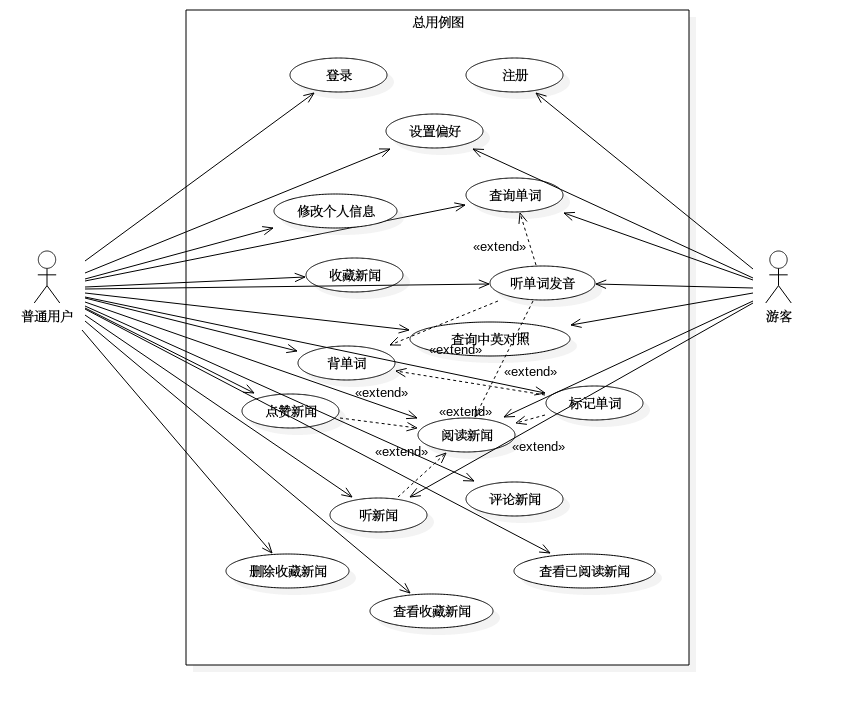
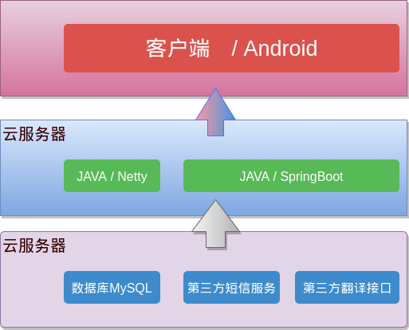
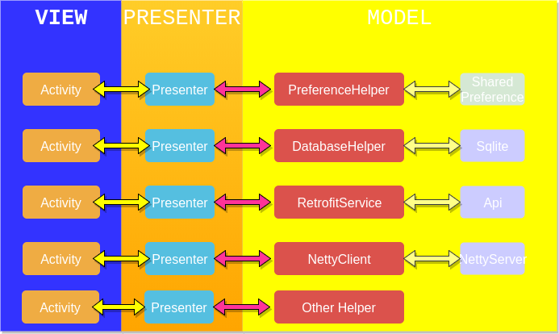
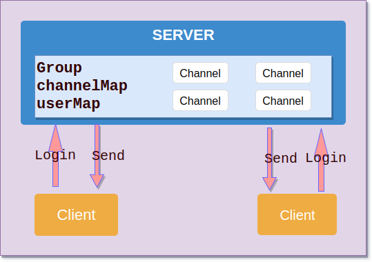

# VNews-SpringBoot

### Introduction
​	我们的 App 以英语新闻阅读为主，我们会为用户提供高质量的英语新闻文章，用户不仅可以锻炼自己的英语阅读能力，也可以从中了解时事政治，或者是有趣的文章。围绕着这一主题，我们还可以实现单词查询，发音，摇一摇背单词，以及单词文章标记收藏、回顾等功能，当然，用户还可以通过评论进行互动。

### Use case Diagram

### Contents

- 新闻
  - 浏览 
  - 收藏
  - 评论
  - 阅读
- 单词
  - 查询
  - 详情
  - 收藏
  - 复习
- 通知
  - 评论
- 用户
  - 注册 
  - 登录
  - 足迹
  - 设置

### Architecture
- **Framework**  
  
- **Android**  
  
- **Message**  
  
### Features
- 文章取词
- 单词词库
- 即时通讯
### Develop Guide

- MVP模式 => 安卓
- Retrofit + RxJava2 => 网络
- Spring-Boot => 后端
- Netty => 即时通讯

### Deployment

- 后端 : API Service + Message System
- Android : Release APK

### Prospect

- 用户个性化推荐
- 数据库优化

### Projects Address

- [Android](https://github.com/wzes/VNews-Android)
- [Service](https://github.com/wzes/VMovie-SpringBoot)
- [Message](https://github.com/wzes/VNew-Netty)

### Thanks

- [Netty](https://github.com/netty/netty)
- [Retrofit2](https://github.com/square/retrofit)
- [RxJava2](https://github.com/ReactiveX/RxJava)
- [Room](https://developer.android.google.cn/training/data-storage/room/index.html)
- [Glide](https://github.com/bumptech/glide)
- [Banner](https://github.com/youth5201314/banner)
- [CircleImageView](https://github.com/hdodenhof/CircleImageView)
- [AppIntro](https://github.com/apl-devs/AppIntro)
- [Leakcanary](https://github.com/square/leakcanary)
- [Lz4](https://github.com/lz4/lz4-java)
- [Butterknife](https://github.com/JakeWharton/butterknife)
- [FastJson](https://github.com/alibaba/fastjson)
- [GalleryPick](https://github.com/YancyYe/GalleryPick)
- [MaterialSearchView](https://github.com/MiguelCatalan/MaterialSearchView)
- [Luban](https://github.com/Curzibn/Luban)

### Contributor
- 寸宣堂
- 师凯杰
- 杜若衡
