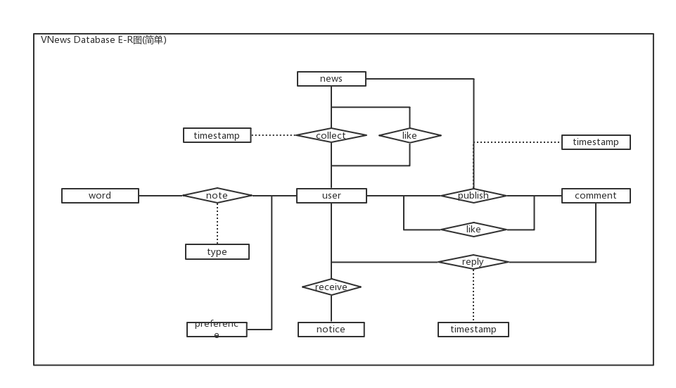

# VNews-SpringBoot

### Introduction
​	我们的 App 以英语新闻阅读为主，我们会为用户提供高质量的英语新闻文章，用户不仅可以锻炼自己的英语阅读能力，也可以从中了解时事政治，或者是有趣的文章。围绕着这一主题，我们还可以实现单词查询，发音，摇一摇背单词，以及单词文章标记收藏、回顾等功能，当然，用户还可以通过评论进行互动。

### Use case Diagram


### Contents

- 新闻
  - 浏览 
  - 收藏
  - 评论
  - 阅读
- 单词
  - 查询
  - 详情
  - 收藏
  - 复习
- 通知
  - 评论
- 用户
  - 注册 
  - 登录
  - 足迹
  - 设置

#### 数据库设计
E-R图
 
SQL Script
```
<!-- 新闻实体数据 -->
CREATE TABLE IF NOT EXISTS news (
    ID          INT AUTO_INCREMENT,
    title       VARCHAR(255)   NOT NULL ,
    author      VARCHAR(50),
    description VARCHAR(255),
    image       VARCHAR(255) COMMENT 'image url',
    publishedAt DATETIME     COMMENT 'publish date',
    source      VARCHAR(50),
    content     TEXT           NOT NULL COMMENT 'the content of news',
    level       VARCHAR(50),
    type        VARCHAR(50),
    PRIMARY KEY (ID)
)ENGINE = INNODB DEFAULT CHARSET = utf8
<!-- 单词实体数据 -->
CREATE TABLE IF NOT EXISTS words (
  ID       INT(20) AUTO_INCREMENT
    PRIMARY KEY,
  word     VARCHAR(100)        NOT NULL,
  exchange VARCHAR(1000)       NULL,
  voice    VARCHAR(1000)       NULL,
  times    INT(20) DEFAULT '1' NULL
);
CREATE TABLE IF NOT EXISTS pos (
  ID    INT(2) AUTO_INCREMENT
    PRIMARY KEY,
  name  VARCHAR(20) NULL,
  means VARCHAR(45) NULL
);
CREATE TABLE IF NOT EXISTS means (
  wordID INT(20)       NOT NULL,
  posID  INT(2)        NOT NULL,
  means  VARCHAR(1000) NULL,
  CONSTRAINT fk_means_1
  FOREIGN KEY (wordID) REFERENCES words (ID),
  CONSTRAINT fk_means_2
  FOREIGN KEY (posID) REFERENCES pos (ID)
);

CREATE INDEX fk_means_1_idx
  ON means (posID);

CREATE INDEX fk_means_1_idx1
  ON means (wordID);

CREATE TABLE IF NOT EXISTS missing (
    ID   INT(20) AUTO_INCREMENT
      PRIMARY KEY,
    word VARCHAR(200) NOT NULL
);
<!-- 用户实体数据 -->
CREATE TABLE IF NOT EXISTS user (
  ID        VARCHAR(20)   NOT NULL,
  username  VARCHAR(50)   NOT NULL,
  password  VARCHAR(255)  NOT NULL,
  email     VARCHAR(50)   NOT NULL,
  sex       VARCHAR(4)    NULL,
  birthday  DATE          NULL,
  image     VARCHAR(255)  NULL,
  telephone VARCHAR(11)   NULL,
  motto     VARCHAR(100)  NULL,
  info      TEXT NULL,
  PRIMARY KEY(ID)
)ENGINE = INNODB DEFAULT CHARSET = utf8;
<!-- 新闻评论实体数据 -->
CREATE TABLE IF NOT EXISTS comment (
  ID        INT           AUTO_INCREMENT PRIMARY KEY,
  fromID    INT           REFERENCES user(ID),
  toID      INT           REFERENCES user(ID),
  content   TEXT          NOT NULL,
  timestamp TIMESTAMP     NOT NULL,
  newsID    INT           REFERENCES news(ID)
)ENGINE=InnoDB  DEFAULT CHARSET=utf8;
<!-- 新闻通知实体数据 -->
CREATE TABLE IF NOT EXISTS notice (
  ID        INT           AUTO_INCREMENT PRIMARY KEY,
  newsID    INT           REFERENCES news(ID),
  fromID    INT           REFERENCES user(ID),
  toID      INT           REFERENCES user(ID),
  content   TEXT          NOT NULL,
  timestamp TIMESTAMP     NOT NULL
)ENGINE=InnoDB  DEFAULT CHARSET=utf8;

<!-- 新闻类型实体数据 -->
CREATE TABLE IF NOT EXISTS type (
  ID        INT           AUTO_INCREMENT PRIMARY KEY,
  name      VARCHAR(50)   NOT NULL
)ENGINE=InnoDB  DEFAULT CHARSET=utf8;
<!-- 用户偏好数据 -->
CREATE TABLE IF NOT EXISTS user_preference (
  userID        VARCHAR(20)      REFERENCES user(ID),
  typeID        INT              REFERENCES type(ID),
  preference    INT              DEFAULT 0,
  PRIMARY KEY (userID, typeID)
)ENGINE=InnoDB  DEFAULT CHARSET=utf8;
<!-- 新闻点赞数据 -->
CREATE TABLE IF NOT EXISTS like_news (
  userID        VARCHAR(20)      REFERENCES user(ID),
  newsID        INT              REFERENCES news(ID),
  timestamp     TIMESTAMP        NOT NULL,
  PRIMARY KEY (userID, newsID)
)ENGINE=InnoDB  DEFAULT CHARSET=utf8;
<!--收藏单词记录-->
CREATE TABLE IF NOT EXISTS collect_words (
  userID        VARCHAR(20)      REFERENCES user(ID),
  wordID        INT              REFERENCES words(ID),
  tag           VARCHAR(50)      NOT NULL,
  timestamp     TIMESTAMP        NOT NULL,
  PRIMARY KEY (userID, wordID)
)ENGINE=InnoDB  DEFAULT CHARSET=utf8;
<!--评论点赞记录-->
CREATE TABLE IF NOT EXISTS like_comment (
  userID        VARCHAR(20)      REFERENCES user(ID),
  commentID     INT              REFERENCES comment(ID),
  timestamp     TIMESTAMP        NOT NULL,
  PRIMARY KEY (userID, commentID)
)ENGINE=InnoDB  DEFAULT CHARSET=utf8;
<!-- 新闻浏览记录-->
CREATE TABLE IF NOT EXISTS view_news (
  newsID        INT        REFERENCES news(ID),
  count         INT,
  PRIMARY KEY (newsID)
)ENGINE=InnoDB  DEFAULT CHARSET=utf8;

```

### Contributor
- 寸宣堂
- 师凯杰
- 杜若衡
